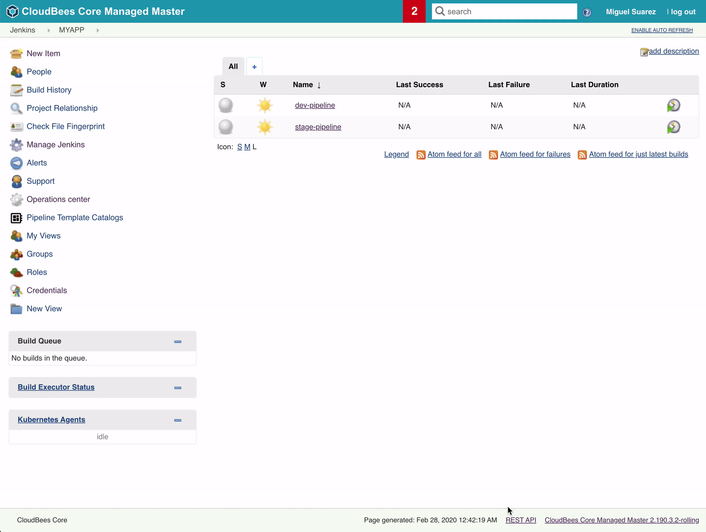

# Jira/Core integration

This is a simple integration between Jira (https://hub.docker.com/u/atlassian) and CloudBees Core Modern 2.190.3.2 (Helm chart - cloudbees-core-3.7.0+ffcae9c08fc6). Both applications were deployed in K8s - 1.13.12 on GKE.

## Description

- The purpose of this exercise is to create one pipeline (Jenkinsfile-dev) that triggers and passes arguments to another pipeline (Jenkinsfile-stage) - https://github.com/mluyo3414org/jiraexample/blob/master/Jenkinsfile-dev#L53

- The stage pipeline will be waiting for approval to proceed using the input step with a timeout of 2 hours -https://github.com/mluyo3414org/jiraexample/blob/master/Jenkinsfile-stage#L42 . See 'submitter' option in https://jenkins.io/doc/pipeline/steps/pipeline-input-step/ in order to only allow authorized users to approve input step in case this needs to be implemented. 

- Credentials are used to make REST call to JIRA API -https://github.com/mluyo3414org/jiraexample/blob/master/Jenkinsfile-stage#L44 . Make sure user/token or password is created in Jira that has the correct permission to create a ticket.

- JIRA documentation for the call in the stage-pipeline: https://developer.atlassian.com/server/jira/platform/jira-rest-api-examples/#creating-an-issue-examples

- Jira Project Key for this example is "MYAP" https://github.com/mluyo3414org/jiraexample/blob/master/Jenkinsfile-stage#L54
The description in the ticket created in JIRA adds URL for input step for the stage-pipeline job https://github.com/mluyo3414org/jiraexample/blob/master/Jenkinsfile-stage#L54 so that the continuation (i.e deployment in stage) can be triggered from an external system. Recommendations: Use these parameters in the REST call as variables.

## Notes

* Both pipelines use public containers (in Kubernetes) to execute the stages.
* This example is just to use as guidance for your own pipelines. Use at your own risk.
* This setup is not using any plugin and is based on REST calls.

## Prereqs:

* Install CloudBees Core and create a Managed Master

https://docs.cloudbees.com/docs/cloudbees-core/latest/gke-install-guide/installing-gke-using-helm

* Create a token for your CloudBees user so that it can approve an input step using a REST call

https://support.cloudbees.com/hc/en-us/articles/115003090592-How-to-re-generate-my-Jenkins-user-token

* Install Jira

https://hub.docker.com/r/atlassian/jira-software

## Testing the pipelines in your Master

* Create two pipeline jobs in your master: one named dev-pipeline and one named stage-pipeline

* Create credentials in order to connect to Jira. Make sure it matches the name here (jira-credentials): https://github.com/mluyo3414org/jiraexample/blob/master/Jenkinsfile-stage#L44 

* Start dev-pipeline (Recommendation: add webhooks to avoid manual triggering - https://support.cloudbees.com/hc/en-us/articles/224543927-GitHub-Integration-Webhooks) 

* Once dev-pipeline finishes, it passes parameter (i.e version) to stage-pipeline where the input step waits for approval.

* Once approved, the JIRA ticket is created with a description that includes the second input step that will allow the continuation of the pipeline. This can be executed from another system using a POST command as demonstrated from the terminal.

